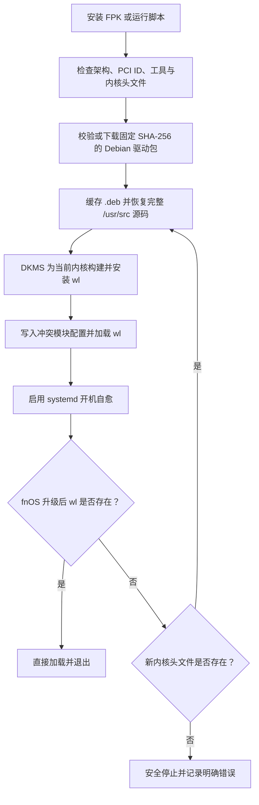

# 工作原理

## 持久化位置

| 路径 | 用途 |
| --- | --- |
| `/var/lib/fnos-bcm4360-wl/` | 驱动包缓存及源码备份 |
| `/usr/src/broadcom-sta-6.30.223.271` | DKMS 源码 |
| `/usr/local/sbin/fnos-bcm4360-wl` | 持久安装脚本 |
| `/etc/systemd/system/fnos-bcm4360-wl.service` | 开机自愈服务 |
| `/etc/modprobe.d/fnos-bcm4360-wl.conf` | 冲突无线模块黑名单 |
| `/etc/modules-load.d/fnos-bcm4360-wl.conf` | `wl` 自动加载配置 |

FPK 应用卷中还保留脚本和离线驱动包。应用启动时若发现 systemd 入口被清理，会从应用卷重新执行完整安装，形成应用层与 systemd 层双重恢复。
